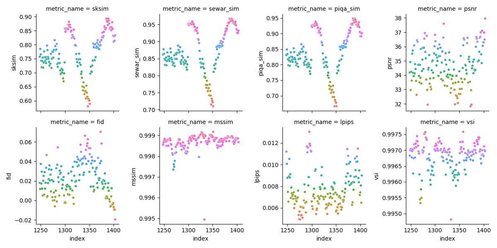

# Anomaly Detection in Brain MRI scans of Alzheimers patients using CFG Diffusion Models

Goal of this project is to train a diffusion model to detect anomalies in brain MRI scans of patients with Alzheimer's Disease. Specifically a Classifier-Free Guidance (CFG) diffusion model is trained to learn representation of 2D Slices of brain MRI, using guidance from various ground-truth Azlhemers classes: 

- Control Normal (CN)
- EMCI (Early Mild Cognitive Impairment)
- MCI (Mild Cognitive Impairment)
- LMCI (Late Mild Cognitive Impairment)
- AD (Alzheimers Disease)

During Inference, an input image(2D slice from 3D Volume) is run through the diffusion-process to perform image-image translation/reconstruction towards a healthy class. Depending on the guidance-scale, the reconstructed image should be closer to the healthy class, while still retaining the overall structure of the input image. Performing a pixel-difference between the input and reconstructed image should give us structural anomalies.

2D Slices are extracted from 3D Volumes for both Training and Inference tasks.
These 2D Slices are 128x128 in resolution and belong to the 5 classes mentioned above.

For each scan, 156 slices were extracted, in the range: 35% to 75% of the 3D Volume in each dimensions. This results in 52 slices for each dimension starting from 44th slice to 95th slice. This was done with a hypotheis that most relevant information would be in 35% to 75% of the 3D Volume in each dimension. Further this should also help with ignoring blank voxels around the brain scan

## Jupyter notebook

Step-by-step Walkthrough of training and inference can be found in the jupyter-notebook: [Adni2dDiffusionAnomalyDetection.ipynb](Adni2dDiffusionAnomalyDetection.ipynb).

## Command-line Scripts

### Training

Usage:

```zsh
python Adni2dDiffusionAnomalyDetection.py --training \
                #--debug \ 
                ---device mps \
                --datasetDir ./data \
                --modelsDir ./models \
                --modelNameHint "128x128" \
                --diffusionModelFileName adni_2d_cfg_diffusion.pt \
                --embFileName adni_2d_cfg_emb.pt \
                --make_symlinks
```

#### "task" dir
Training-Script expects a "task"-dir under `--datasetDir`
For eg. in this case `task=2d_cfg_anom_det`. Given this, a typical file structure can be

```
data
├──2d_cfg_anom_det/
    ├── dataset.json
    ├── cn/
    ├── emci/
    ├── mci/
    ├── lmci/
    ├── ad/
```

#### dataset.json
Training Script (`Adni2dDiffusionAnomalyDetection.py`) expects a `dataset.json` file in the `task`-dir. 
Json file should be structured with the following format:

```json
[{"image": "cn/cn0.nii.gz", "slice_label": 1},
 {"image": "emci/emci0.nii.gz", "slice_label": 2},
 {"image": "mci/mci0.nii.gz", "slice_label": 3},
 {"image": "lmci/lmci0.nii.gz", "slice_label": 4}
 {"image": "ad/ad0.nii.gz", "slice_label": 5}
]
```

#### Inference

Inference-script extracts all slices within a given range (35% to 75% of the 3D Volume in all dimensions), runs them through inference.

After reconstructing a "Healthy"-image from the input slice, it performs a pixel-diff and calculates Image-Simalirty score using SSIM, PSNR, MS-SIM, LPIPS, FID, VSI metrics.

Usage:

```zsh
python Adni2dDiffusionAnomalyDetection.py --inference \
                # --debug \ To run in interactive mode i.e will allow visualization after each reconstruction
                ---device mps \
                --datasetDir ./data \
                --modelsDir ./models \
                --modelNameHint "128x128" \
                --diffusionModelFileName adni_2d_cfg_diffusion.pt \
                --embFileName adni_2d_cfg_emb.pt \
                --make_symlinks \
                --infDict \
                "{\"image\": \"data/2d_cfg_anom_det/ad/ad0.nii.gz\", \"label\": 5}" \
                --inferenceOutDir ./inference.out
```
## Results

Inference was run on 73 MRI scans from class=AD. 

To recap, for each scan, 156 slices were extracted, in the range: 35% to 75% of the 3D Volume in each dimensions. This results in 52 slices for each dimension starting from 44th slice to 95th slice. This was done with a hypotheis that most relevant information would be in 35% to 75% of the 3D Volume in each dimension. Further this should also help with ignoring blank voxels around the brain scan.

### Similarity metrics across slices in a given volume/brain-scan
For each healthy image reconstruction, a similarity-score is calculated using standard metrics such as SSIM, PSNR, MS-SIM, LPIPS, FID, VSI metrics.

Following is a plot showing how each of these metrics varies across all slices for two random brain scans among these 73 scans:
Of these similarity metrics, SSIM seem to give somewhat significant variance across slices in any given volume.





### SSIM metric across all volumes

Following plot shows SSIM metric for all 73 volumes.

From this we can see that slices vary similarly across all brain-scans. 


There are a few scans which follow a different pattern, notably the following, which are analyzed in a later section below:

- 1366711
- I356652
- I334830
- 1366695
- I356725
- I1383270

### Identifying outlier SSIM slices for a given volume

Following is the image with lowest SSIM score (`0.47583`):


Further slice-level analysis can be done by filtering all slices whose SSIM score is less than 0.6.

